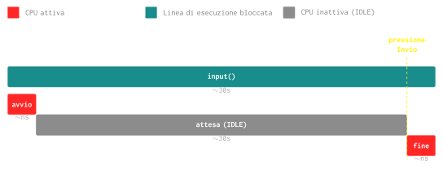

# Operazioni I/O: Linea di esecuzione bloccata

Definiremo qui cosa si intende con linea di esecuzione bloccata.

Per farlo partiremo dalla funzione `input()` nell'esempio precedente.

---

## Funzione `input()`

La funzione `input()` di python è una operazione di I/O molto semplice, essa permette all'utente di digitare una stringa da tastiera e _aspetta_ fino a quando non si preme il tasto Invio.

Cosa significa quell'_aspetta_? Significa che:

- La funzione `input` utilizza la CPU solo all'inizio.
- Non utilizza la CPU fino a quando non viene premuto il tasto Invio.
- Ri-usa la CPU per ritornare l'output arrivato dalla tastiera in fase conclusiva.

---

Riprendendo l'esempio precedente, la prossima linea ad essere eseguita sarà la linea #1:

```{.python linenums="1" data-next-orange="1"}
nome=input("Inserisci il tuo nome")
if len(nome) < 5:
    print("Nome troppo corto.")
else:
    print(f"Ciao {nome}")
```

Questo significa che per $N$ secondi (fintanto che non verrà premuto Invio) avremo la seguente situazione senza però che la CPU venga ==effettivamente utilizzata==:

```{.python linenums="1" data-exec-orange="1"}
nome=input("Inserisci il tuo nome")
if len(nome) < 5:
    print("Nome troppo corto.")
else:
    print(f"Ciao {nome}")
```

## Diagramma di Gantt

Qui di seguito mostriamo il diagramma di Gantt dell'utilizzo della CPU durante l'esecuzione della linea #1:

- La prima riga descrive la finestra temporale di esecuzione della funzione (30 secondi).
- La seconda riga mostra il tempo di utilizzo della CPU:
    - Qualche nanosecondo all'inizio[^1].
    - Un trentina di secondi di inattività (si dice **IDLE**) che finiscono quando l'utente preme il tasto _Invio_.
    - Qualche nanosecondo alla fine[^1].




E traiamo le seguenti importanti ==conclusioni==:

- La linea di esecuzione è **^^bloccata^^** fintanto che l'utente non preme Invio.
- Il tempo di utilizzo della CPU è ^^minimo^^ rispetto al tempo di esecuzione della linea.

## Conclusione

!!! warning "Linea di esecuzione BLOCCATA"
    Una linea di esecuzione è bloccata quando:

    - Lo sbocco avviene tramite un evento esterno.
    - Durante l'attesa dell'evento non utilizza la CPU.


[^1]: I tempi della CPU, naturalmente sono molto più piccoli di un secondo.

<!-- 
Riferiamoci qui ad un socket TCP utilizzando in una comunicazione HTTPS client-server:

=== "Client"
    ```python  linenums="1"
    from socket import socket
    s = socket(AF_INET, SOCK_STREAM)
    s.connect((IP_SERVER, 443))
    s.send(request)
    response = s.recv(buffer_size)
    s.close()
    ```

=== "Server"
    ``` py
    from socket import socket
    s = socket(AF_INET, SOCK_STREAM)
    s.bind((IP_SERVER, 443))
    s.listen()
    s.accept()
    request = s.recv(buffer_size)
    elabora(request)
    s.send(response)
    s.close()
    ```

Le operazioni di I/O sono definite come:

> Le operazioni le quali richiedono l'utilizzo della CPU solamente nella fase iniziale e nella fase finale.

Ecco qui le operazioni di I/O evidenziate:

=== "Client"
    ```python  linenums="1" hl_lines="3 4 5"
    from socket import socket
    s = socket(AF_INET, SOCK_STREAM)
    s.connect((IP_SERVER, 443))
    s.send(request)
    response = s.recv(buffer_size)
    s.close()
    ```

=== "Server"
    ```python  linenums="1" hl_lines="5 6 8"
    from socket import socket
    s = socket(AF_INET, SOCK_STREAM)
    s.bind((IP_SERVER, 443))
    s.listen()
    s.accept()
    request = s.recv(buffer_size)
    elabora(request)
    s.send(response)
    s.close()
    ```

Ovvero:

- `connect` e `accept`: la prima avvia la richiesta di stabilire una connessione TCP, la seconda lo accetta.
- `send` e `recv`: la prima invia il dato, la seconda lo riceve.


L'esecuzione di tali operazioni, quindi:

- Dipende dall'esecuzione dell'altra operazione (`connect` e `accept`, `send` e `recv`).
- Dipende dal tempo di trasmissione che introduce una latenza.

 -->