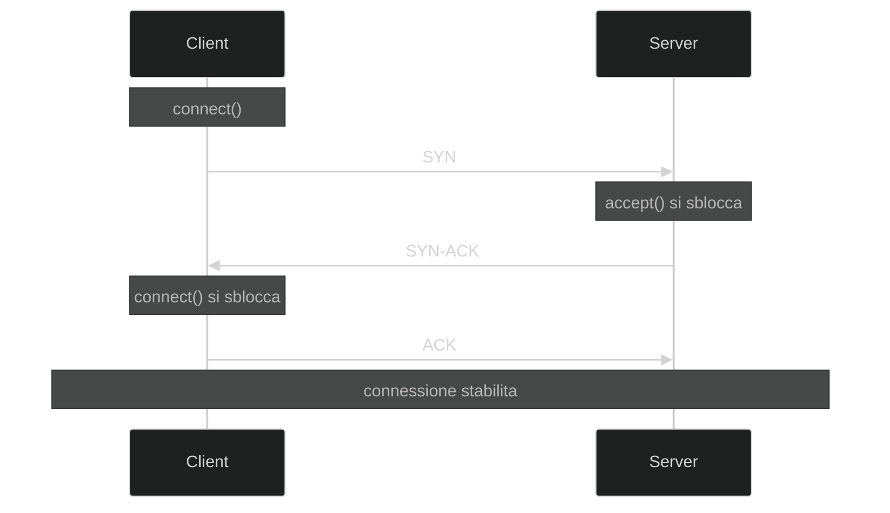

# `connect` e `accept`

Nel protocollo TCP, la connessione viene stabilita tramite un **three-way handshake** (stretta di mano a tre vie):

1. `client` → `server` - pacchetto  **SYN** (*synchronize*):
    - Il client richiede l'apertura della connessione dicendo:
    > client: _"il mio numero di sequenza è X"_.

2. `server` → `client` - pacchetto **SYN+ACK** (*synchronize-acknowledge*):
    - Il server conferma al client inviandogli un pacchetto che è ==^^sia^^ SYN che ACK==:
    > server: _"il tuo numero di sequenza è X, il mio numero di sequenza è Y"_.

3. `client` → `server` - pacchetto **ACK** (*acknowledge*):
    - Il client conferma la ricezione del **SYN+ACK** del server:
    > client: _"il tuo numero di sequenza è Y"_.

4. A questo punto la connessione è stabilita e i dati possono essere trasmessi.

Nel seguente schema è possibile notare cosa accade e quando si sbloccano le varie linee di esecuzione:

---

## Diagramma di Gantt

Di seguito il diagramma di Gantt dell'utilizzo della CPU durante `send()` e `recv()`:

- La CPU viene utilizzata solo all'inizio (preparazione del pacchetto / avvio ricezione) e alla fine (ricezione ACK / consegna dati).
- Nel mezzo, la linea di esecuzione è **bloccata** in attesa della rete.

### Client: `send()`

### Server: `recv()`

### Insieme: `send()` e `recv()`

