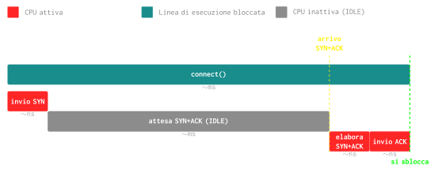
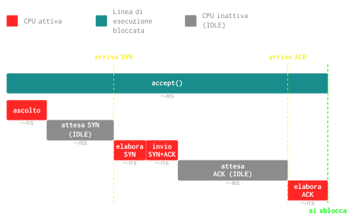
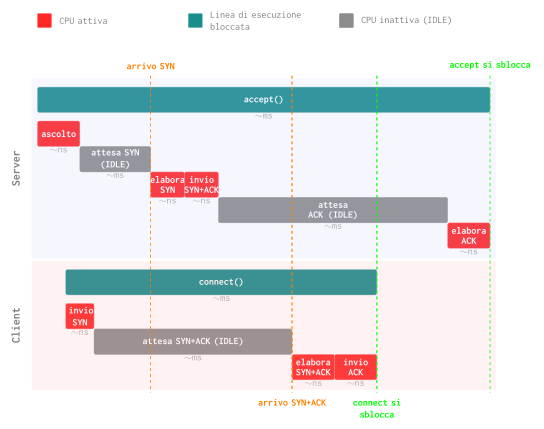

# `connect` e `accept`

Nel protocollo TCP, la connessione viene stabilita tramite un **three-way handshake** (stretta di mano a tre vie):

1. `client` → `server` - pacchetto  **SYN** (*synchronize*):
    - Il client richiede l'apertura della connessione dicendo:
    > client: _"il mio numero di sequenza è X"_.

2. `server` → `client` - pacchetto **SYN+ACK** (*synchronize-acknowledge*):
    - Il server conferma al client inviandogli un pacchetto che è ==^^sia^^ SYN che ACK==:
    > server: _"il tuo numero di sequenza è X, il mio numero di sequenza è Y"_.

3. `client` → `server` - pacchetto **ACK** (*acknowledge*):
    - Il client conferma la ricezione del **SYN+ACK** del server:
    > client: _"il tuo numero di sequenza è Y"_.

4. A questo punto la connessione è stabilita e i dati possono essere trasmessi.

Nel seguente schema è possibile notare cosa accade e quando si sbloccano le varie linee di esecuzione:

---

## Diagramma di Gantt

Di seguito il diagramma di Gantt dell'utilizzo della CPU durante `connect()` e `accept()`:

### Client - `connect()`

Quando viene eseguita la funzione `connect()` la linea di esecuzione è bloccata. Durante tale esecuzione, la CPU viene utilizzata **due** volte:

- Quando viene avviata:
    - La CPU viene usata per inviare il pacchetto `SYN` al server.
- Quando arriva il pacchetto `SYN+ACK` dal server:
    - La CPU viene usata per elaborare il pacchetto.
    - La CPU viene usata per inviare l'`ACK` al client.

Succesivamente la linea di esecuzione è sbloccata.

### Server - `accept()`

Quando viene eseguita la funzione `accept()` la linea di esecuzione è bloccata. Durante tale esecuzione, la CPU viene utilizzata **tre** volte:

- Quando viene avviata:
    - La CPU viene usata per mettersi in _posizione_ di ascolto di connessioni in entrata.
- Quando arriva il pacchetto `SYN`$_53$ dal client:
    - La CPU viene usata per elaborare il pacchetto.
    - La CPU viene usata per inviare l'`SYN+ACK` al client.
- Quando arriva l'`ACK` finale dal client:
    - La CPU viene usata per elaborare il pacchetto.
Succesivamente la linea di esecuzione è sbloccata.

### Insieme: `connect()` e `accept()`

