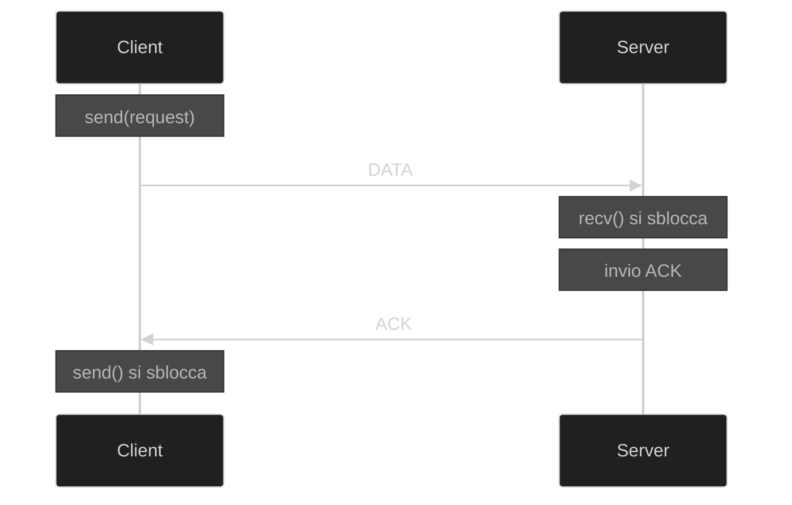
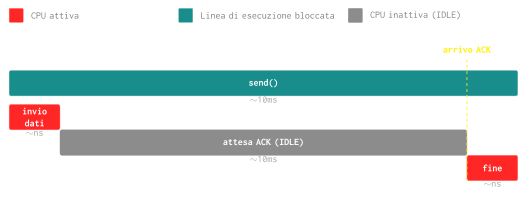
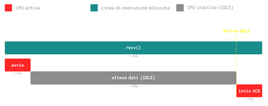
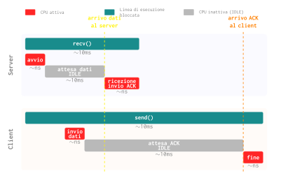

# `send` e `recv`

Nel seguente schema è possibile notare cosa accade e quando si sbloccano le varie linee di esecuzione:

---

## Diagramma di Gantt

Di seguito il diagramma di Gantt dell'utilizzo della CPU durante `send()` e `recv()`:

- La CPU viene utilizzata solo all'inizio (preparazione del pacchetto / avvio ricezione) e alla fine (ricezione ACK / consegna dati).
- Nel mezzo, la linea di esecuzione è **bloccata** in attesa della rete.

### Client: `send()`

### Server: `recv()`

### Insieme: `send()` e `recv()`

